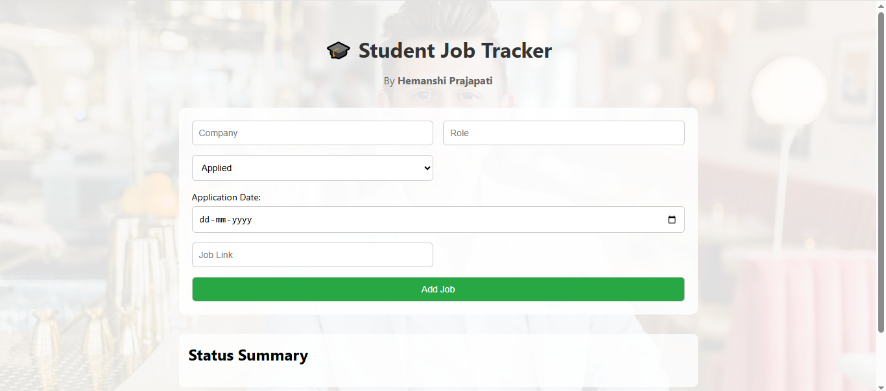

# 🎓 Student Job Tracker

> Track all your job applications in one place — stay organized, stay ahead!



---

## 🚀 Live Demo

- 🔗 Frontend: [Live Site](https://your-vercel-app.vercel.app)
- 🔗 Backend: [Backend Code](https://student-job-tracker-backend-qo0n.onrender.com)

---

## 📌 Description

**Student Job Tracker** is a full-stack web app designed to help students keep track of job/internship applications. You can add roles, update statuses, link job postings, and monitor your application progress — all from one clean dashboard.

Built as part of a Fullstack Developer TA Internship assignment, this project showcases frontend, backend, and data structure implementation.

---

## 🛠️ Tech Stack

- **Frontend:** React, CSS
- **Backend:** Node.js, Express.js
- **Database:** MongoDB Atlas
- **Deployment:** Vercel (Frontend) & Render (Backend)

---

## ✨ Features

- ➕ Add job applications
- 🔄 Update job status (Applied, Interview, Offer, Rejected)
- 🗑️ Delete applications
- 📅 Track application date
- 🔗 View job posting link
- 📊 DSA solutions in JavaScript included

---

## 📂 Folder Structure
- 📁 client # React frontend
- 📁 server # Node.js + Express backend
- 📁 dsa # JavaScript solutions for DSA task

---


## 🧠 DSA Solution

**Problem:**  
🟢 **Status Frequency Counter :**
Given an array of job applications with status, return the count of each status.

🗂️ **Location:** `/dsa/statusFrequecyCounter.js

🔍 **Logic:**
1. Initialize an empty object to store counts.
2. Loop through the array of applications.
3. For each application's status:
   - If it already exists in the object, increment the count.
   - If not, initialize it with 1.
4. Return the object.
---

## 📦 How to Run Locally

```bash
# Clone the repo
git clone https://github.com/yourusername/student-job-tracker.git

# Frontend
cd client
npm install
npm start

# Backend
cd server
npm install
node index.js
